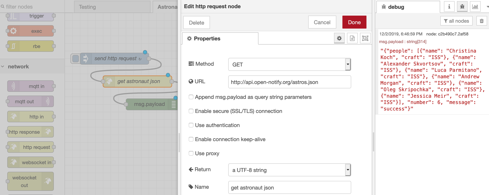

# Names

**CIot**
	Cloudless Internet of Things (?)

**IoT**
	Intranet of Things (psuedonymous on Hackaday)

**LANoT**
	Local Area Network of Things (?)

**LANoH**
	Local Area Network of Hacky-things (Eliot Williams on Hackaday)

**NoT**
	Network of Things 

**SNoT**
	Secure Network of Things

## MQTT

### Installation

For MQTT you'll need a broker to act as the main switchboard for all your messages, and a client running on each of your devices.  For testing purposes it's good to install both a broker and client module on whatever computer you're running the broker on.  You can do this with whatever package manager you use, here are some examples:

Linux/Debian/Ubuntu:
```bash
> sudo apt install mosquitto mosquitto-clients
```

MacOS:
```bash
> sudo port install mosquitto mosquitto-clients
```

or

```bash
> brew install mosquitto mosquitto-clients
```

### Commands

To start a broker (in verbose mode):

```bash
> mosquitto -v
```

The basic format for subscribing to a topic, and for publishing a message to that topic:

```bash
> mosquitto_sub -h [host ip] -t [topic]
> mosquitto_pub -h [host ip] -t [topic] -m [message]
```

example:

```bash
> mosquitto_sub -h 129.168.0.23 -t led 
> mosquitto_pub -h 129.168.0.23 -t led -m 255,0,255
```

You can use `#` and `+` as wildcards to susbscribe to more than one topic.  You cannot use wildcards to publish to more than one topic.

**living_room/#**
	all topics for all devices in your living room

**living_room/+/bulb**
	all the lightbulbs in your living room

### Configuration

By default the mosquitto broker runs on port 1883.

## Things on ESP boards

### Flashing micropython onto the board

First, let's erase whatever is on the ESP board, and flash it with MicroPython.  We'll use esptool for both steps, which you can install with `pip` with one of the following (or however else you like to do python package management):

```bash
> pip install esptool.py
> pip3 install esptool.py
```

The code you'll want to flash can be found at [http://micropython.org/download](http://micropython.org/download).  

You have to specify which USB port your board is on, and you can find that by typing `[tab]` after `/dev/tty.` to see what the possibilities are:

```bash
> esptool.py --port /dev/tty.
tty.AVSamsungSoundbarK450K-  tty.SLAB_USBtoUART
tty.Bluetooth-Incoming-Port  tty.SOC
tty.MALS                     tty.usbserial-00FEB022
```

That `SLAB_USBtoUART` one is the one we want. First erase:

```bash
> esptool.py --port /dev/tty.SLAB_USBtoUART erase_flash
esptool.py v2.8
Serial port /dev/tty.SLAB_USBtoUART
Connecting........_
Detecting chip type... ESP8266
Chip is ESP8266EX

Features: WiFi
Crystal is 26MHz
MAC: 18:fe:34:d4:0d:3e

Uploading stub...
Running stub...
Stub running...
Erasing flash (this may take a while)...
Chip erase completed successfully in 9.1s
Hard resetting via RTS pin...
```

Then flash:

```bash
> esptool.py --port /dev/tty.SLAB_USBtoUART --baud 460800 write_flash --flash_size=detect 0 Desktop/esp8266-20190529-v1.11.bin
esptool.py v2.8
Serial port /dev/tty.SLAB_USBtoUART
Connecting........_
Detecting chip type... ESP8266
Chip is ESP8266EX
Features: WiFi
Crystal is 26MHz
MAC: 18:fe:34:d4:0d:3e
Uploading stub...
Running stub...
Stub running...
Changing baud rate to 460800
Changed.
Configuring flash size...
Auto-detected Flash size: 4MB
Flash params set to 0x0040
Compressed 617880 bytes to 402086...
Wrote 617880 bytes (402086 compressed) at 0x00000000 in 9.7 seconds (effective 511.6 kbit/s)...
Hash of data verified.

Leaving...
Hard resetting via RTS pin...
```

Finally, run `screen`, which will let us interact directly with the serial (USB) port so that we can get an interactive python prompt from our python installation on the board:

```bash
> screen /dev/tty.SLAB_USBtoUART 115200
```

Hit `enter` to get a prompt.

Hit `ctrl-D` to reset it, which will display the version of micropython that's flashed to the board.

To quit type `ctrl-A` `ctrl-\`.

In screen, put the board on your local network by:

```python
>>> import network
>>> wlan = network.WLAN(network.STA_IF)
>>> wlan.active(True)
#8 ets_task(4020f4d8, 28, 3fff9e28, 10)
>>> wlan.connect("your_wifi", "password") # your local wifi credentials go here
```

To see your board's ip address:

```
>>> wlan.ifconfig()
('192.168.0.38', '255.255.255.0', '192.168.0.1', '192.168.0.1')
```

It's the first address.  **Remember this**, you'll use it in a bit.

### Enabling webrepl

```python
>>> import webrepl_setup
WebREPL daemon auto-start status: disabled

Would you like to (E)nable or (D)isable it running on boot?
(Empty line to quit)
> E
To enable WebREPL, you must set password for it
New password (4-9 chars): mypassword
Confirm password: mypassword
Changes will be activated after reboot
Would you like to reboot now? (y/n)
```

### Is it working?

If you have an ESP with an onboard LED, you can confirm everything is working by lighting up an LED:

```python
>>> from machine import Pin                                                
>>> p = Pin(14,Pin.OUT)                                                      
>>> p.on()                                                                     
>>> p.off()                                                                    
```

If you have one with an OLED screen, import the libraries and instantiate an object:

```python
>>> import ssd1306 from machine
>>> i2c = machine.I2C(-1, machine.Pin(5), machine.Pin(4))
>>> oled = ssd1306.SSD1306_I2C(128, 32, i2c)
```

And here's how you use it:

```python
>>> oled.fill(1) # fill the screen with white (actually blue)
>>> oled.fill(0) # fill the screen with black
>>> oled.text("hello",0,0,1) # ("text", x, y, black/white)
>>> oled.show() # actually display now
```

You can always find more info with `dir()` and `help()`:

```python
dir(oled)
help(oled)
```

But for full documentation check out the micropython documentation pages.

Documentation for the oled screen is here: [https://docs.micropython.org/en/latest/library/framebuf.html](https://docs.micropython.org/en/latest/library/framebuf.html)

### Using webrepl

#### Setup

To view webrepl in your browser go to [http://micropython.trmm.net/](http://micropython.trmm.net/).  **Note:** make sure your browser doesn't correct it to be `https`.  You'll want to use the `http` site or it won't work.  If you run the HTTPS Everywhere extension, disable it for this page.

Replace the IP address in the text box with the one for your ESP board, and hit `Connect`.  If you forgot the IP address, you can run screen again in a terminal, then:

```python
>>> import network
>>> wlan = network.WLAN(network.STA_IF)
>>> wlan.ifconfig()
```

You'll see at the bottom it says use `ctrl-A` and `ctrl-V` to paste.  If you want to paste multiple lines of code use `ctrl-E` instead (or upload it as a file).  To quit use `ctrl-a` `ctrl-\`.

If end up with no prompt because code is running, hit `ctrl-C` to quit the `while(true)` loop.

#### Workflow

We want to be able to write, run, debug, write, run, debug... etc.

You can write your code on your laptop, then push the file to the board using the "Send a file" area.  To then run the code, type `import [filename without the .py part]`.  So if my file is `led.py`, I want to type `import led`.

You're not limited to one file, you can have several on the board at once.  If you want one to be the code that gets run automatically whenever the board boots, name it `main.py` and run `import main`.  

When you want to resend the file after debugging, you will have to delete the module first (sorry).  You'll need to import `sys` for this:

```python
>>> import sys
>>> del sys.modules['led']
```

Now send the debugged file and import again.  (You only need to import `sys` once.)

Now we can write, run, and debug over and over again.

You can also run small snippets of code directly from the python prompt to test things out if you want.

## Node Red

### Installation

If you don't already have node.js installed, get it here: [https://nodejs.org/en/download/](https://nodejs.org/en/download/)

Next, install Node Red: [https://nodered.org/docs/getting-started/local](https://nodered.org/docs/getting-started/local)

Once it is done installing, if you click "Running" in the side bar there's detailed information on how to use it.

When you run `node-red` it will provide you with some useful information:

```bash
2 Dec 17:44:35 - [info] Settings file  : /Users/holly/.node-red/settings.js
2 Dec 17:44:35 - [info] Context store  : 'default' [module=memory]
2 Dec 17:44:35 - [info] User directory : /Users/holly/.node-red
2 Dec 17:44:35 - [warn] Projects disabled : editorTheme.projects.enabled=false
2 Dec 17:44:35 - [info] Flows file     : /Users/holly/.node-red/flows_geode.json
2 Dec 17:44:35 - [info] Server now running at http://127.0.0.1:1880/
```

Note that node red runs on port 1880 by default (MQTT runs on port 1883).

### Node Editor

For a basic interaction, find a "slider" node and plug it into a "debug" node.  You might have to install the dashboard module first:

Hamburger menu --> Manage Palette --> install node-red-dashboard

View the dashboard by going to the url of your palette with a `/ui` added to the end (or click the dashboard icon in the node editor).

**In order for changes you made in the node editor to take effect, you have to click "Deploy".**  You will be clicking "Deploy" a lot.

Node Red's basic function is to send messages from one thing to another.  While these messages can enter Node Red in any number of formats (http, mqtt, html, xml, etc.) once inside Node Red they are converted to and passed around as json objects.  Here is the basic structure:

```javascript
{
	"key": "value",
	"key": "value"
}
```

When you open a node containing code, by default the message object will be called `msg`, and the actual message being passed will be in the "payload" property:

```javascript
msg = {
	"payload": "on"
}
```

Above is a common example where you want to pass the string "on" to a device to, for example, turn on a lightbulb.

The payload can be a string, as above, a number (don't use quotes), a boolean (true or false), an array:

```javascript
msg = {
	"payload": ["red","blue","green"]
}
```

or it can be an object:

```javascript
msg = {
	"payload": {
		"bulb1": "on",
		"bulb2": "off"
	}	
}
```

### APIs



## Troubleshooting

**Can't connect to micropython.org/webrepl**

Try the `http` site and _not_ the `https` site.  If you try to access from the `https` site browsers may refuse to serve the "insecure content" from the websocket.

## To Do

### Document the QOS settings for mqtt

The broker will hold the last message sent, and if you run
`mq.wait_msg()` the board will listen for a message again and get
whatever was sent in the interim (with the current qos configuration,
this can be changed).

## Setting up a Raspberry Pi

### Basic Setup

These instructions are for a headless (no monitor) Raspberry Pi W0.

Raspberry Pi's keep their operating system on an SD card, so the first thing we have to do is flash a card with the appropriate operating system.

First download the "lite" version of the most recent Raspbian version here: [https://www.raspberrypi.org/downloads/raspbian/](https://www.raspberrypi.org/downloads/raspbian/)

We'll use Etcher for flashing the OS onto the Pi, so download and install it: [https://www.balena.io/etcher/](https://www.balena.io/etcher/)

(So, I guess if you're running Catalina find a friend with Linux to flash your SD card because that seems to be broken in Catalina right now?)

Now, we'll need to get the wifi credentials onto the board since we're not connecting it to a monitor.  Instructions for that are here: [https://www.raspberrypi.org/documentation/configuration/wireless/headless.md](https://www.raspberrypi.org/documentation/configuration/wireless/headless.md)

Now you need to find the ip address of your Raspberry Pi.  `nmap` is good for this. 

[...some steps skipped...]

Having just set up your pi, it's in a bit of a dangerous state since remote login is enabled and the default username and password are `pi` and `raspberry`.  Log in and create a .ssh directory in pi's home directory:

```
holly@geode:~ > ssh pi@192.168.0.39
pi@raspberrypi:~ $ mkdir .ssh
```

From your local machine, transfer your public ssh key to the pi:

```
holly@geode:~/.ssh >  scp id_rsa.pub pi@192.168.0.39:/home/pi/.ssh/authorized_keys
pi@192.168.0.39's password:
id_rsa.pub                                    100%  399    71.6KB/s   00:00
```

Now, before you turn off password login, make sure you can successfully log into the pi.  So exit, and ssh back in.

```
pi@raspberrypi:~/.ssh $ exit
logout
Connection to 192.168.0.39 closed.
holly@geode:~ >  ssh pi@192.168.0.39
Enter passphrase for key '/Users/holly/.ssh/id_rsa':
Linux raspberrypi 4.19.75+ #1270 Tue Sep 24 18:38:54 BST 2019 armv6l

The programs included with the Debian GNU/Linux system are free software;
the exact distribution terms for each program are described in the
individual files in /usr/share/doc/*/copyright.

Debian GNU/Linux comes with ABSOLUTELY NO WARRANTY, to the extent
permitted by applicable law.
Last login: Sat Nov 23 15:09:38 2019 from 192.168.0.10

SSH is enabled and the default password for the 'pi' user has not been changed.
This is a security risk - please login as the 'pi' user and type 'passwd' to set a new password.

pi@raspberrypi:~ $
```

and turn off password login by editing `/etc/ssh/sshd_config`, searching for the line `#PasswordAuthentication yes` and changing the yes to no and uncomment the line (remove the `#`).

To make the changes take effect, restart `ssh` with:

```
pi@raspberrypi:~ $ sudo /etc/init.d/ssh restart
[ ok ] Restarting ssh (via systemctl): ssh.service.
```

or just reboot the pi.

You'll probably want to change the hostname of your pi.  Edit two files, `/etc/hosts` and `/etc/hostname`, replacing all instance of "raspberrypi" with whatever you want the hostname to be, then reboot the pi (`sudo reboot`).

Now let's get the os up to date:

```
pi@raspberrypi:~ $ sudo apt update
pi@raspberrypi:~ $ sudo apt upgrade
```

### Installing MQTT

```
pi@raspberrypi:~ $ sudo apt install mosquitto mosquitto-clients
```

## Best Practices

### Circuits

**Unplug** your microcontroller before you change the wiring.

**Black wire** for ground.

**Red wire** for power.

Connect in this order:
	1. ground
	1. power
	1. data


## Resources

"How Consumer IoT Devices Expose Information" [https://labs.ripe.net/Members/anna_maria_mandalari_2/how-consumer-iot-devices-expose-information](https://labs.ripe.net/Members/anna_maria_mandalari_2/how-consumer-iot-devices-expose-information)

Hackaday talk about cloudless IoT [https://hackaday.com/2019/11/07/found-footage-elliot-williams-talks-nexus-technologies/](https://hackaday.com/2019/11/07/found-footage-elliot-williams-talks-nexus-technologies/)

Candle, privacy-friendly smarthome [https://www.candlesmarthome.com/](https://www.candlesmarthome.com/)

Snips, private-by-design voice assistant [https://snips.ai/](https://snips.ai/)

MQTT [https://mqtt.org/](https://mqtt.org/)

Node Red, "low code" programming for networked things [https://nodered.org/](https://nodered.org/)

Cloning a Raspberry Pi [https://raspberrypi.stackexchange.com/questions/93315/cloning-the-raspberry-pi-sd-card-as-a-balenaetcher-ready-instal-able-image](https://raspberrypi.stackexchange.com/questions/93315/cloning-the-raspberry-pi-sd-card-as-a-balenaetcher-ready-instal-able-image)

Adafruit NeoPixel Uberguide [https://learn.adafruit.com/adafruit-neopixel-uberguide/the-magic-of-neopixels](https://learn.adafruit.com/adafruit-neopixel-uberguide/the-magic-of-neopixels)

Adafruit ESP8266 Feather Huzzah pinout and guide:
[https://learn.adafruit.com/adafruit-feather-huzzah-esp8266/pinouts/](https://learn.adafruit.com/adafruit-feather-huzzah-esp8266/pinouts/)
