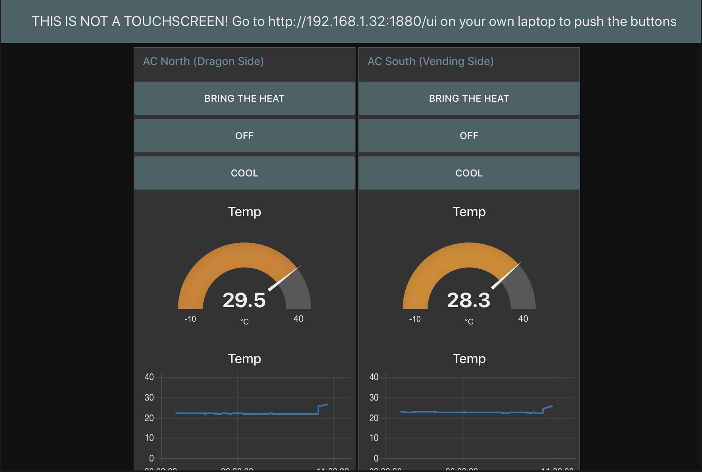
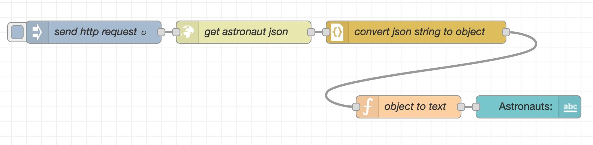
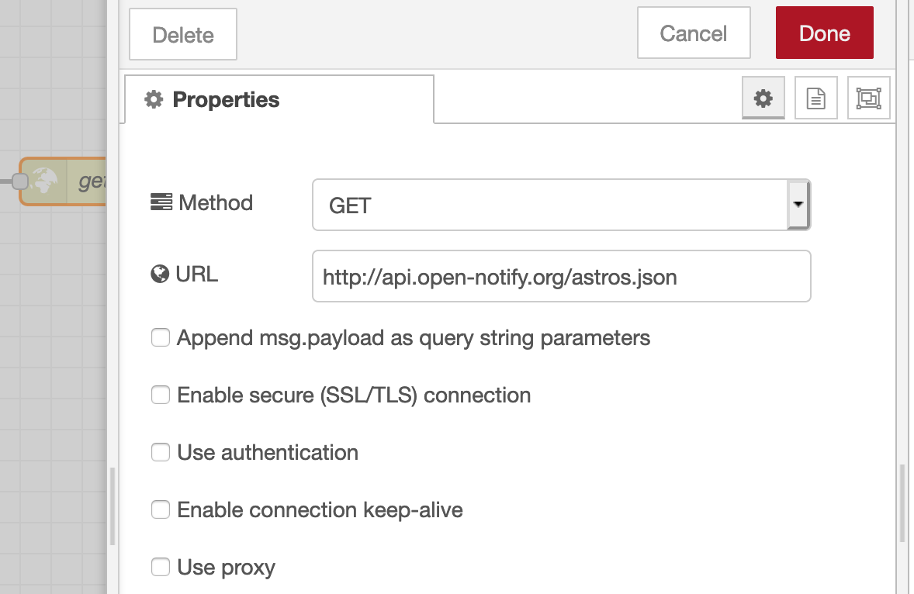

<!-- START doctoc generated TOC please keep comment here to allow auto update -->
<!-- DON'T EDIT THIS SECTION, INSTEAD RE-RUN doctoc TO UPDATE -->
**Table of Contents**  *generated with [DocToc](https://github.com/thlorenz/doctoc)*

- [STEP ONE](#step-one)
- [Things on ESP boards](#things-on-esp-boards)
  - [Using webrepl](#using-webrepl)
    - [Setup](#setup)
    - [Workflow](#workflow)
- [MQTT](#mqtt)
  - [Configuration](#configuration)
- [Node Red](#node-red)
  - [Installation](#installation)
  - [Node Editor](#node-editor)
  - [APIs](#apis)
  - [Saving your work](#saving-your-work)
- [Best Practices](#best-practices)
  - [Circuits](#circuits)
  - [MQTT](#mqtt-1)
  - [In general](#in-general)
- [Using the OLED screen](#using-the-oled-screen)
- [Resources](#resources)
  - [Hardware](#hardware)
  - [Software](#software)
  - [Products/Inspiration](#productsinspiration)
  - [Tutorials and Talks](#tutorials-and-talks)
  - [Readings](#readings)
- [What shall we call this?](#what-shall-we-call-this)

<!-- END doctoc generated TOC please keep comment here to allow auto update -->

# STEP ONE

Install mosquitto (the most popular implementation of MQTT).

**For Linux**
 	It's probably already there.  Run `which mosquitto` to check.

**For Mac**
	Use your favorite package manager to install to install `mosquitto` and `mosquitto-clients`.  If you don't have a favorite package manager, a lot of people like homebrew: [https://brew.sh/](https://brew.sh/), but I prefer MacPorts: [https://www.macports.org/](https://www.macports.org/).  Install one and type `brew install mosquitto mosquitto-clients` or `port install mosquitto mosquitto-clients`.  If it fails, take off the `mosquitto-clients` part and try again.

**For Windows**
	The website has a download option: [https://mosquitto.org/download/](https://mosquitto.org/download/).


# Things on ESP boards

You can find detailed information about the board we are using here:
[https://github.com/Heltec-Aaron-Lee/WiFi_Kit_series](https://github.com/Heltec-Aaron-Lee/WiFi_Kit_series)

Today the boards have been set up for you.  When you plug them in they will already be on the wifi.  At home you can run `boot/setup.sh` to put your board on your home wifi.  If you buy a different type of ESP board, you can use the instructions in the `webreple-from-scratch.md` file.

## Using webrepl

### Setup

To view webrepl in your browser go to the IP address displayed on your ESP board.  

To get a prompt, click in the screen and press enter.  The password is set to `abcd` by default (this and other boot settings can be changed by editing `boot/boot.py`).

Useful commands:

**ctrl-C**
	stop the current program

**ctrl-A ctrl-V**
	paste one line

**ctrl-E**
	paste several lines of code

**ctrl-A ctrl-\\**
	quit
	
**up arrow**
	cycle through previous commands

If things stop working, reload the page and/or reset the board.

### Workflow

Load code onto the board by using the "Send a file" area.

Run the code with by importing the file name, minus the `.py` part:

```python
import led
```

If you want to load a revised version to the board (after fixing a bug), you have to un-import the module and then import it again.  So, after fetching the code with the "Send a file" area, do:

```python
>>> unimport("led")
>>> import led
```

_The `unimport()` function is a custom tool written for this workshop.  If it's not available, you can `import sys` then run `del sys.modules['led']` instead._

You can always test things by running small snippets of code directly from the python prompt in the webrepl if you want.

For instance, blinking an LED:

```python
>>> from machine import Pin                                                
>>> p = Pin(0,Pin.OUT)                                                      
>>> p.on()                                                                     
>>> p.off()                                                                    
```

# MQTT

MQTT is a simple, lightweight messaging protocol.  To create an MQTT network, designate one machine as your "broker" (server), and start the broker on that machine:

```bash
> mosquitto -v
```

The `-v` flag puts it in verbose mode.

You can then publish (tell) and subscribe (listen), from any device running the client software, with these commands:

```bash
> mosquitto_sub -h [IP address of broker] -t [topic]
> mosquitto_pub -h [IP address of broker] -t [topic] -m [message]
```

For example:

```bash
> mosquitto_pub -h 192.168.0.10 -t sensors/temp -m 23
> mosquitto_sub -h 192.168.0.10 -t sensors/temp
```

Any device can create a topic just by publishing to that topic, and other devices can subscribe to topics that interest them.

You can use `#` and `+` as wildcards for subscribing to mulitple topics.  For example, all the devices in the kitchen:

```
house/kitchen/#
```

The lights in every room in the house:

```
house/+/light
```

_Note: You can only use wildcards for subscribing.  You can not publish to more than one topic at a time._

This is a convenient protocol because of its simplicity.  It has less overhead than http and it's an open standard so it can be freely used and integrated into projects.  There are libraries for several languages (python, javascript, C/C++), so you can script interactions within your network with whatever tools you're most comfortable with.

## Configuration

Where to find `mosquitto.conf`:

* MacOS - `/usr/local/etc/mosquitto`
* Linux - `/etc/mosquitto`
* Windows - `c:\mosquitto\`

By default the mosquitto broker runs on port 1883, unless you intentionally start it on another port: `mosquitto -p 1884`, for instance.

MQTT messages are sent in plaintext.  If you want to encrypt them you have to use SSL.  But there are some other things you can do that are fairly simple to provide some security.

You can restrict who can publish and subscribe to messages by setting client ID restrictions on your broker.

# Node Red


You'll probably want one central hub for all of your device information and automation logic to reside so that there is one central place to go when you want to add a feature or if something breaks.  

You could script things together with your favorite programming language, but Node Red provides a convenient unified interface for both your DIY things and your consumer IoT devices.  It's a low-code environment, so it will be easier for members of your household who do not code to understand and tweak.  In addition it provides a browser-based dashboard that you can access from laptops and phones.



## Installation

If you don't already have node.js installed, get it here: [https://nodejs.org/en/download/](https://nodejs.org/en/download/)

Next, install Node Red: [https://nodered.org/docs/getting-started/local](https://nodered.org/docs/getting-started/local)

On the website, if you click "Running" in the side bar you'll see detailed information on how to use it once it's installed.

On the command line type `node-red` to start it, and it will provide you with some useful information:

```bash
2 Dec 17:44:35 - [info] Settings file  : /Users/holly/.node-red/settings.js
2 Dec 17:44:35 - [info] Context store  : 'default' [module=memory]
2 Dec 17:44:35 - [info] User directory : /Users/holly/.node-red
2 Dec 17:44:35 - [warn] Projects disabled : editorTheme.projects.enabled=false
2 Dec 17:44:35 - [info] Flows file     : /Users/holly/.node-red/flows_geode.json
2 Dec 17:44:35 - [info] Server now running at http://127.0.0.1:1880/
```

Note that node red runs on port 1880 by default (MQTT runs on port 1883).

## Node Editor

**In order for changes you made in the node editor to take effect, you have to click "Deploy".**  You will be clicking "Deploy" a lot.

Node Red's basic function is to send messages from one thing to another.  While these messages can enter Node Red in any number of formats (http, mqtt, html, xml, etc.) once inside Node Red they are converted to and passed around as json objects.  Here is the basic structure:

```javascript
{
	"key": "value",
	"key": "value"
}
```

You can modify messages and automate decisions based on messages by using the available nodes, and when you want to customize behavior even further you can use a "function" node.  Inside the function node you can modify incoming messages with javascript, and then "return" them to the following node.  When you open it you'll see `return msg;` in the textbox.  You just add your code above that.  The incoming message object is stored in the `msg` variable, so if you do nothing the message will pass through the node unchanged.

But you probably want to alter the message.  Here's what you need to know.  The actual content of the message is stored in the "payload" property of the message object:

```javascript
msg = {
	"payload": "on"
}
```

Which can also be written:

```javascript
msg.payload = "on";
```

Above is a common example where you want to pass the string "on" to a device to, for example, turn on a lightbulb.

The payload can be a string, as above, a number (don't use quotes), a boolean (true or false), an array, or an object.  For instance, here's a message that I use to set the brightness and color temperature of an Ikea smart bulb, where the payload is an object:

```javascript
msg.payload = {
	"brightness": 150,
	"color_temp": 400
}	
```

Since you can write javascript in the function node, you can add logic.  For example, you'll probably want to turn a bunch of lights on or off at once, but MQTT doesn't let you publish to multiple topics at the same time.  In Node Red you can solve this problem by creating an array of messages in a function node:

```javascript
var incoming_payload = msg.payload; // will be "on" or "off"

var messages = [];

var topics = [
	"home/upstairs/bedroom/light/state",
	"home/upstairs/hall/light/state",
	"home/upstairs/beadroom/heater/state"
];
    
for (var topic of topics) {
	messages.push({payload: incoming_payload, topic: topic});
}
return [messages];
```

Sometimes I declare my variables with `var`, sometimes I don't bother.  In both cases it works.  There's probably something to be said here in regards to best practices.. but 🤷🏻

## APIs

If you want to get online data like weather data, you can do that with an http request to the website of your choice.  Here is an example with my favorite online API:



Inside the http node (the "get astronaut json" node):



And here is the code in the function node that extracts the data we want from the json object so we can display it on the dashboard:

```javascript
var people_obj = msg.payload["people"];
var output_str = "";

for (var person of people_obj) {
	if (person == people_obj[0]) {
		output_str = person.name;
	} else if (person == people_obj[people_obj.length - 1]) {
		output_str = output_str + ", and " + person["name"];
	} else {
		output_str = output_str + ", " + person["name"];
	}
}

output_str = output_str + " are all in space right now."

var new_msg = { "payload": output_str}
return new_msg;
```

## Saving your work

**There is no undo in Node Red.**

Your current flow setup is stored in `~/.node-red/flows_[something].json`.  It's a good idea to make a copy of this file frequently for back up.  If you put it in version control on github, make sure you haven't included any secret authentication information in any of the flows.

Since the structure of the flows is stored as json, you can share your flows, and install other people's flows, by sharing the json description.

# Best Practices

## Circuits

**Unplug** your microcontroller before you change the wiring.

**Black wire** for ground.

**Red wire** for power.

Connect in this order:
	1. ground
	2. power
	3. data

## MQTT

For devices that can be turned on and off, like light bulbs, have two topics, "state" and "set".  Only bulbs publish to "state" (am I on or off), and they get their commands by subscribing to the "set" topic.

Have your devices tell you who they are and where they are every time they send a message.  This makes it easy to locate misbehaving devices if your system grows large.  You can do this with topics, for example:

**helpful** - bedroom/light/multicolor/nightstand
**not helpful** - light23

## In general

Have a central brain, with dumb devices.

It's best to only have the barest minimum of code running on each device.  Put all your control logic and automation code on your main central machine, either in something like Node Red, or in scripts, as you prefer.  When things break this will make it easy to find the problem, and when you want to add features you'll know exactly where to put the code.

# Using the OLED screen

If you have one with an OLED screen, import the libraries and instantiate an object:

```python
>>> import machine
>>> import ssd1306
>>> i2c = machine.I2C(-1, machine.Pin(5), machine.Pin(4))
>>> oled = ssd1306.SSD1306_I2C(128, 32, i2c)
```

And here are some basic commands:

```python
>>> oled.fill(1) # fill the screen with white (actually blue)
>>> oled.fill(0) # fill the screen with black
>>> oled.text("hello",0,0,1) # ("text", x, y, black/white)
>>> oled.show() # actually display now
>>> oled.invert() # invert colors
>>> oled.pixel(x, y, c) # address one pixel
```

Full documentation for the OLED screen is here: [https://docs.micropython.org/en/latest/library/framebuf.html](https://docs.micropython.org/en/latest/library/framebuf.html)

You can always find more info with `dir()` and `help()`:

```python
dir(oled)
help(oled)
```

But for full documentation you'll want to check out the micropython documentation pages online: [http://docs.micropython.org/en/latest/](http://docs.micropython.org/en/latest/)

# Resources

## Hardware

Details for ESP board used in this workshop: 
[https://github.com/Heltec-Aaron-Lee/WiFi_Kit_series](https://github.com/Heltec-Aaron-Lee/WiFi_Kit_series)

Adafruit ESP8266 Feather Huzzah pinout and guide:
[https://learn.adafruit.com/adafruit-feather-huzzah-esp8266/pinouts/](https://learn.adafruit.com/adafruit-feather-huzzah-esp8266/pinouts/)

## Software

MQTT
[https://mqtt.org/](https://mqtt.org/)

Node Red, "low code" programming for networked things
[https://nodered.org/](https://nodered.org/)

## Products/Inspiration

Candle, privacy-friendly smarthome
[https://www.candlesmarthome.com/](https://www.candlesmarthome.com/)

## Tutorials and Talks

Hackaday talk about cloudless IoT
[https://hackaday.com/2019/11/07/found-footage-elliot-williams-talks-nexus-technologies/](https://hackaday.com/2019/11/07/found-footage-elliot-williams-talks-nexus-technologies/)

Adafruit NeoPixel Uberguide
[https://learn.adafruit.com/adafruit-neopixel-uberguide/the-magic-of-neopixels](https://learn.adafruit.com/adafruit-neopixel-uberguide/the-magic-of-neopixels)

Cloning a Raspberry Pi
[https://raspberrypi.stackexchange.com/questions/93315/cloning-the-raspberry-pi-sd-card-as-a-balenaetcher-ready-instal-able-image](https://raspberrypi.stackexchange.com/questions/93315/cloning-the-raspberry-pi-sd-card-as-a-balenaetcher-ready-instal-able-image)

## Readings

"How Consumer IoT Devices Expose Information"
[https://labs.ripe.net/Members/anna_maria_mandalari_2/how-consumer-iot-devices-expose-information](https://labs.ripe.net/Members/anna_maria_mandalari_2/how-consumer-iot-devices-expose-information)

# What shall we call this?

**CIot**
	Cloudless Internet of Things (?)

**IoT**
	Intranet of Things (psuedonymous on Hackaday)

**LANoT**
	Local Area Network of Things (?)

**LANoH**
	Local Area Network of Hacky-things (Eliot Williams on Hackaday)

**NoT**
	Network of Things 

**SNoT**
	Secure Network of Things


