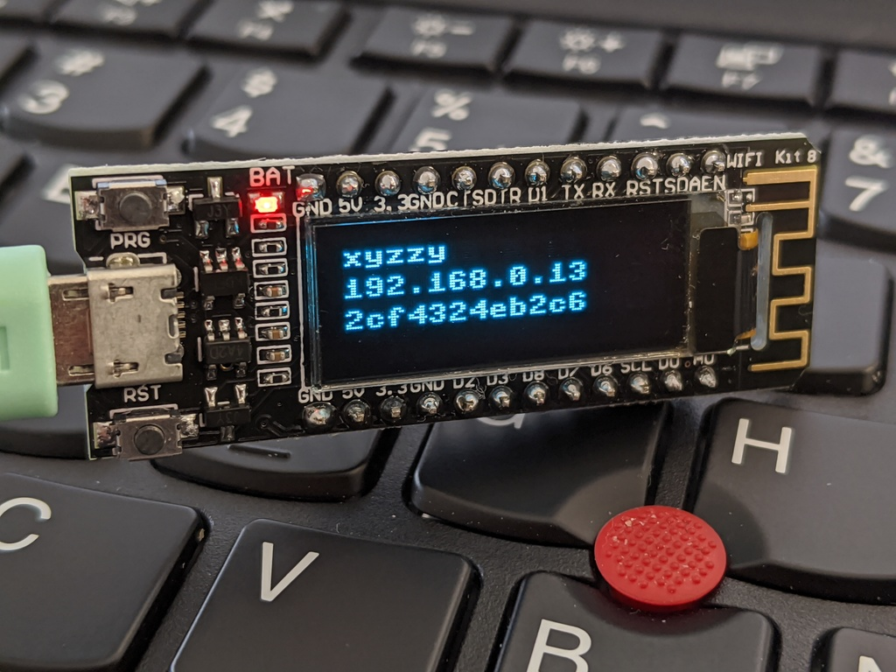

# WiFi boot status


`boot.py` is executed when the Micropython environment starts up.
One of the difficulties with the webrepl is finding the IP address
of the ESP board.

For boards with the 128x32 OLED display, this file can be flashed 
either with the existing webrepl upload tool or using
[`ampy`, the Adafruit Micropython tool](https://github.com/scientifichackers/ampy).


```
ampy -p /dev/ttyUSB0 put boot.py
```

# Initial configuration

The device stores the wifi essid and password in flash, but it needs
to be configured.  Additionally, the webrepl will automatically start
if the `webrepl_cfg.py` file exists and contains a password.

This can be scripted with `ampy.py` as well:

```
ampy -p /dev/ttyUSB0 run config.py
```

