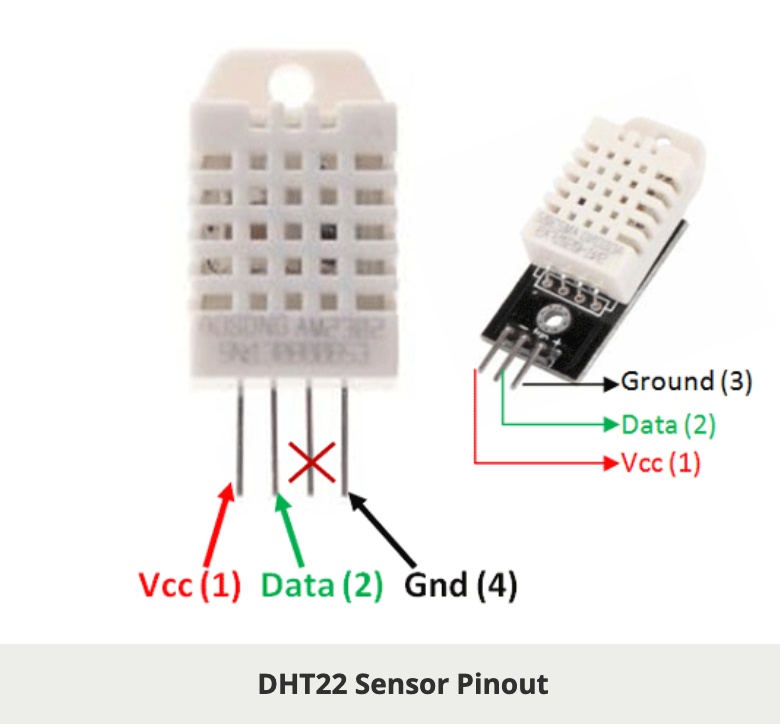
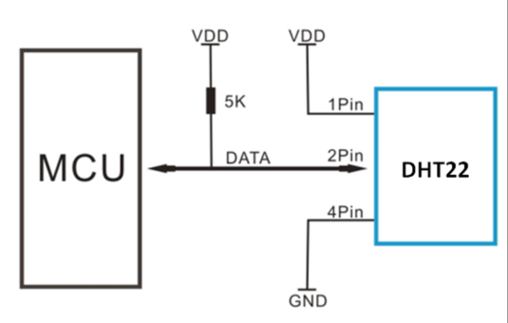

# Environmental Sensors

## DHT22 AM2302 Temperature and Humidity Sensor

### Specifications





Connect the power line to the 3.3V pin (VDD in the diagram), not VBATT (which is 5.5V).  The components on the ESP board are not 5V-tolerant, so you will damage them if you feed 5 volts in, which will happen when the board tries to read from the sensor if the sensor is connected to a 5V power source.  (Note:  You can drive a 5V _output_ component such as a strip of NeoPixels with the VBATT pin because those 5 volts will be going out to the component and not returning to the board.)

When you're done prototyping and you are ready to build your finished device, it's a good idea place the sensor a bit away from the ESP board since the chip on the ESP board gets warm, and that will affect your temperature readings if the sensor is too close.

DHT22 Specifications

* Operating Voltage: 3.5V to 5.5V
* Operating current: 0.3mA (measuring) 60uA (standby)
* Output: Serial data
* Temperature Range: -40°C to 80°C
* Humidity Range: 0% to 100%
* Resolution: Temperature and Humidity both are 16-bit
* Accuracy: ±0.5°C and ±1%

More details here: [https://components101.com/sensors/dht22-pinout-specs-datasheet](https://components101.com/sensors/dht22-pinout-specs-datasheet)

### How do you find this information?

When you use a new component you'll probably have to look up pinouts, possibly wiring diagrams, and sample code or libraries.  It's usually pretty easy to find this information online.  Just search for whatever information you see written on the component.  In this case I did a Duck Duck Go search for AM2302 and found everything I needed.

### Sample code

```python
from machine import Pin
from dht import DHT22

d = DHT22(Pin(14))

d.measure()
d.temperature() # returns degrees celsius
d.humidity() # returns a percent value for relative humidity
```

```python
```
