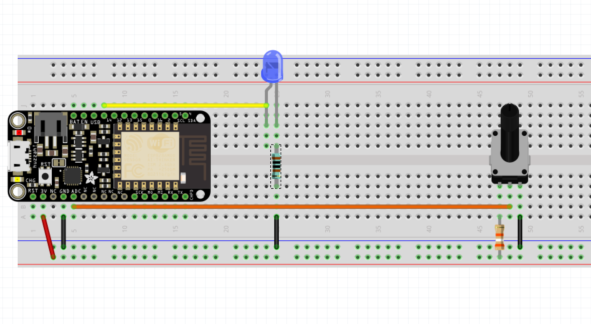
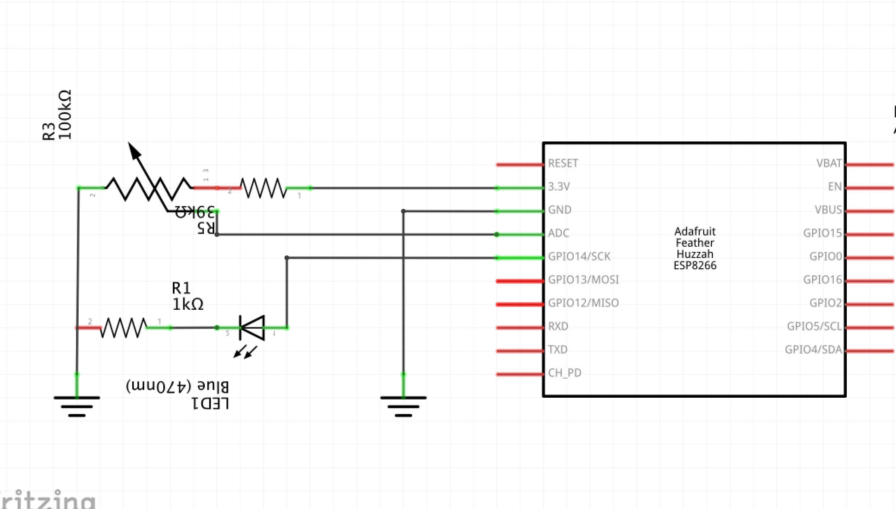

# Project 03 - Change the brightness of an LED with a potentiometer





In general, you wire one side to power, the other side to ground, and the center pin will provide the resistance value that the user has turned the dial to (so connect it to an input pin on your microcontroller).


Image from [build-electronic-circuits.com](https://www.build-electronic-circuits.com/potentiometer/)

```cpp
void setup()
{
    pinMode(LEDPIN, OUTPUT);
    pinMode(POTPIN, INPUT);
    Serial.begin(9600);
}

void loop()
{
    int value = analogRead(POTPIN);
    Serial.println(value);

    analogWrite(LEDPIN, value);
}
```

